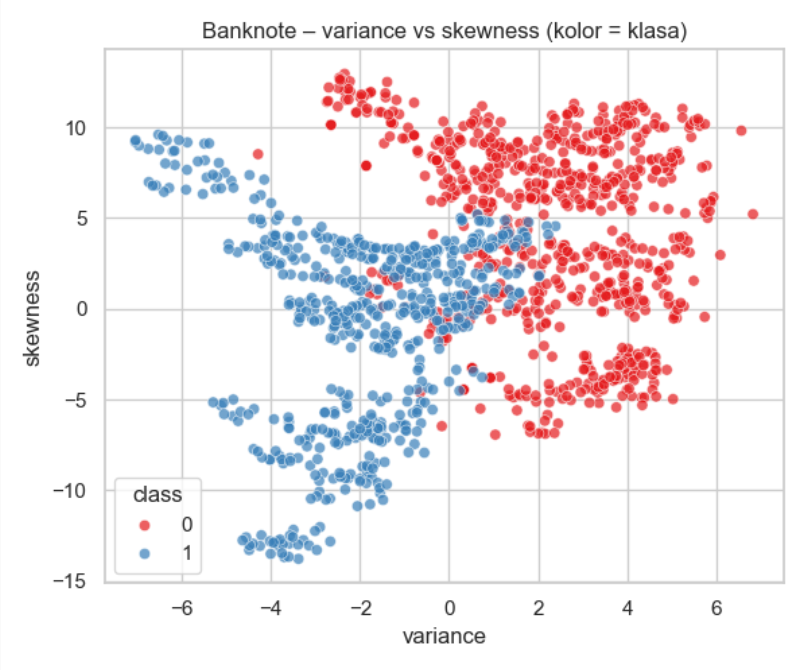
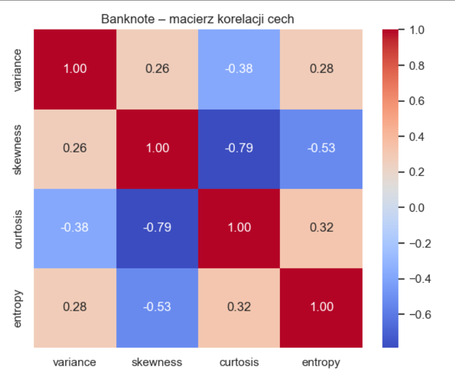
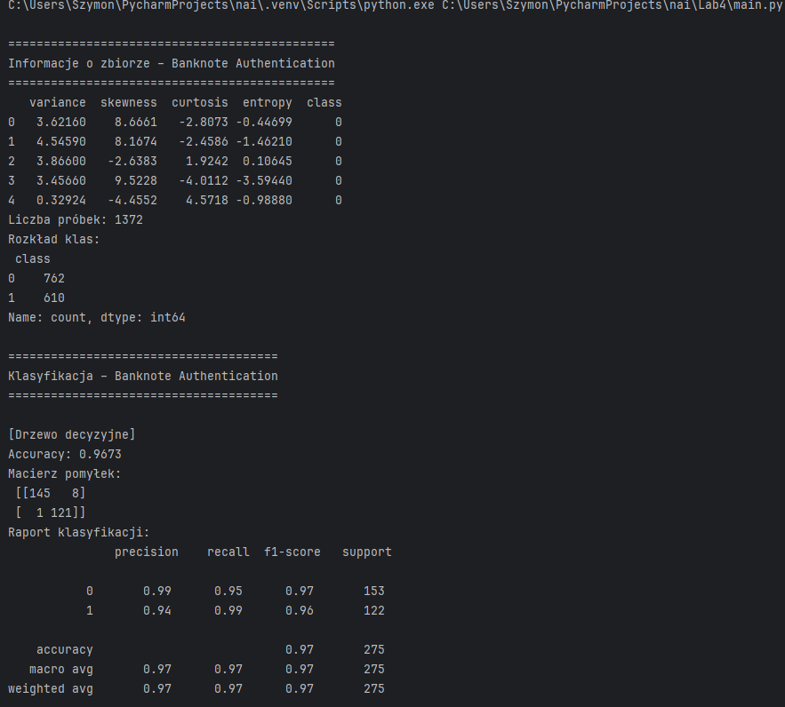
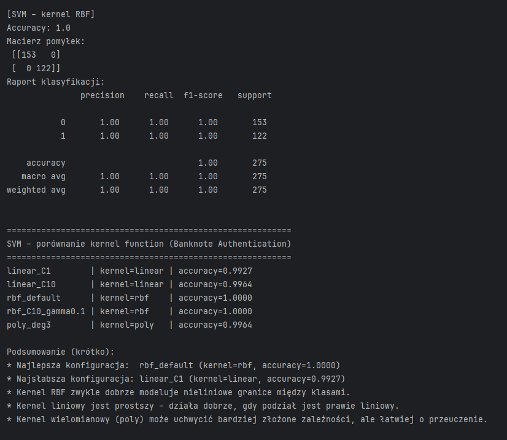
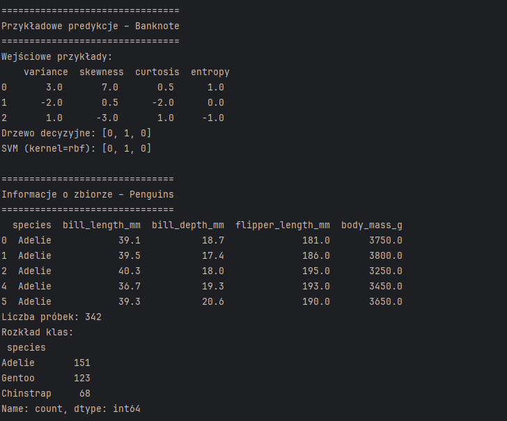
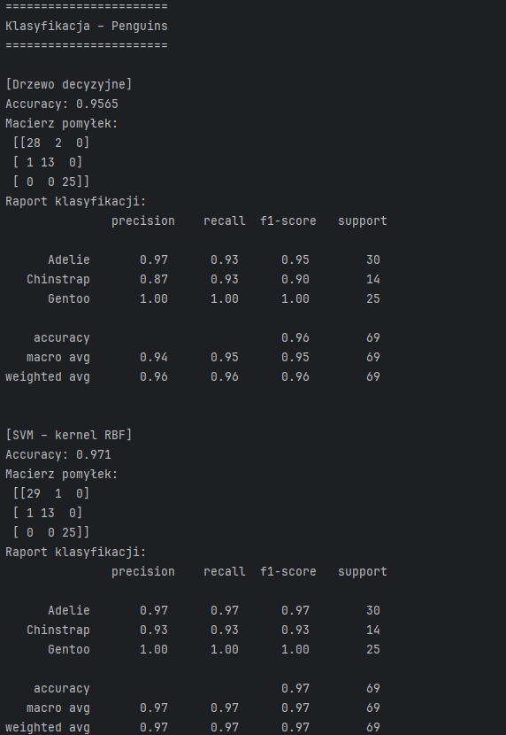
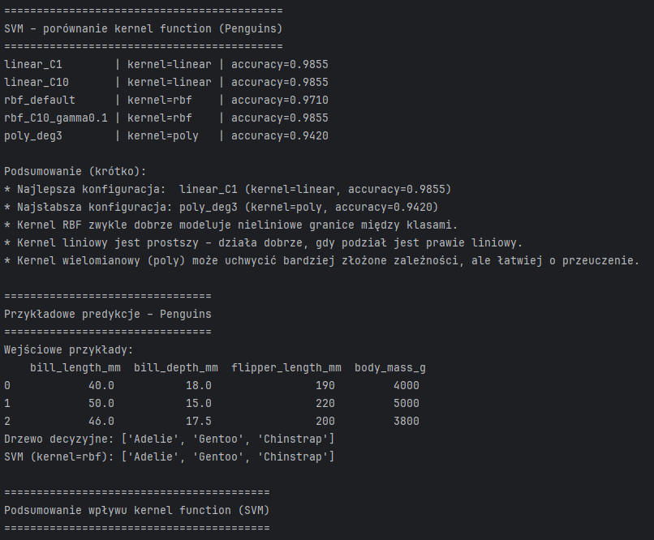
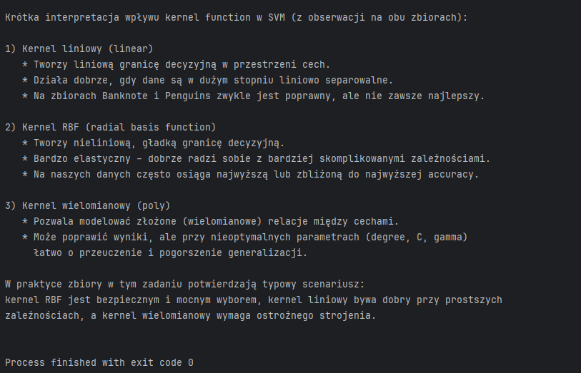

# Lab4 – Prosta klasyfikacja z użyciem Drzewa Decyzyjnego i SVM

## Źródła danych

| Zbiór danych               | Typ zadania               | Link do opisu / danych                                                                 |
|----------------------------|---------------------------|----------------------------------------------------------------------------------------|
| Banknote Authentication    | Klasyfikacja binarna      | [CSV](https://raw.githubusercontent.com/jbrownlee/Datasets/master/banknote_authentication.csv) |
| Penguins                   | Klasyfikacja wieloklasowa | [Kaggle](https://www.kaggle.com/datasets/kainatjamil12/pengunis)                         |

---

## Opis projektu
Projekt realizuje zadanie laboratoryjne z klasyfikacji danych przy użyciu **Drzewa Decyzyjnego** oraz **SVM (Support Vector Machine)**. Skrypt obejmuje:
1. Wczytanie i wstępną analizę dwóch zbiorów danych.
2. Trenowanie modeli klasyfikacyjnych.
3. Ocena jakości klasyfikacji (accuracy, raport klasyfikacji, macierz pomyłek).
4. Wizualizację danych.
5. Demonstrację predykcji na przykładowych danych.
6. Porównanie różnych funkcji jądrowych (kernel function) w SVM.

---

## Uruchomienie projektu
1. **Wymagania**:
   - Python 3.8+
   - Biblioteki: `pandas`, `numpy`, `scikit-learn`, `matplotlib`, `seaborn`
   - Zainstaluj zależności:
     ```bash
     pip install pandas numpy scikit-learn matplotlib seaborn
     ```
2. **Uruchomienie**:
   ```bash
   python lab4.py


## Wizualizacje:






## Output programu:
  
 

  

 

 

 

 
