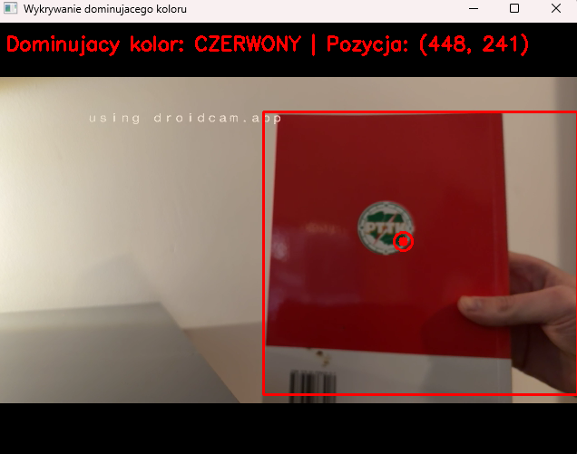
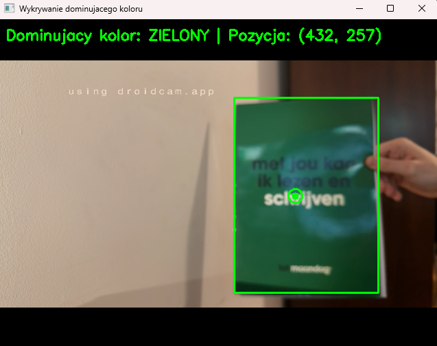

# Lab6 – System wykrywania dominującego koloru z kamery w czasie rzeczywistym

## Opis projektu
Projekt realizuje zadanie laboratoryjne z **Computer Vision** - system analizy obrazu działający w czasie rzeczywistym, który:
1. Analizuje obraz z kamery komputera w czasie rzeczywistym.
2. Rozpoznaje dominujący kolor w aktualnej klatce spośród zdefiniowanego zbioru kolorów (czerwony, zielony, niebieski).
3. Wyznacza pozycję obszaru dominującego koloru w obrazie (bounding box i punkt centralny).
4. Ignoruje pozostałe kolory, analizując wyłącznie wcześniej zdefiniowane klasy kolorów.
5. Prezentuje wyniki w postaci wizualnej poprzez nałożenie oznaczeń na obraz z kamery.

---

## Uruchomienie projektu
1. **Wymagania**:
   - Python 3.8+
   - Biblioteki: `opencv-python`, `numpy`
   - Zainstaluj zależności:
     ```bash
     pip install opencv-python
     pip install numpy
     ```
2. **Przygotowanie**:
   - Upewnij się, że masz podłączoną kamerę komputera
   - Program automatycznie rozpocznie analizę obrazu po uruchomieniu
3. **Uruchomienie**:
   ```bash
   python main.py
   ```
4. **Użycie**:
   - Pokaż kolory (czerwony, zielony, niebieski) przed kamerą
   - System automatycznie wykryje dominujący kolor i wyświetli jego pozycję
   - Naciśnij 'q' aby zakończyć program

---

## Przykład użycia

<video width="640" height="480" controls>
  <source src="przyklad_uzycia.mp4" type="video/mp4">
  Twoja przeglądarka nie obsługuje odtwarzania wideo.
</video>

---

## Przykłady wykrywania kolorów

### Wykrywanie koloru czerwonego


### Wykrywanie koloru zielonego


### Wykrywanie koloru niebieskiego


---

## Framework
**OpenCV (cv2)** - biblioteka do przetwarzania obrazów i analizy wizualnej w czasie rzeczywistym

## Autorzy
Mateusz Andrzejak, Szymon Anikej
