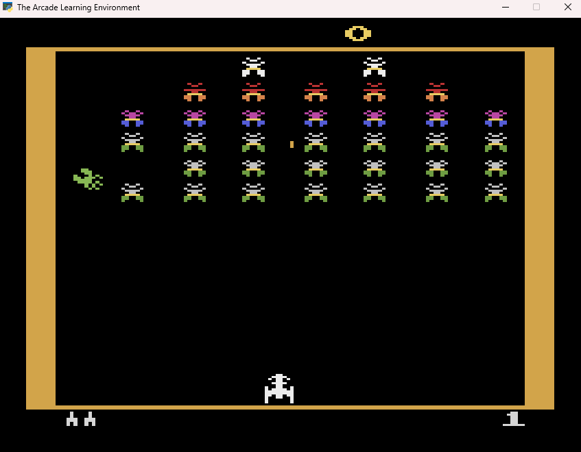

# Lab7 – Bot do gry Galaxian

## Opis projektu
Projekt realizuje zadanie laboratoryjne z **Reinforcement Learning** - bot grający w grę Galaxian (Atari) używając środowiska Gymnasium. Bot:
1. Używa prostej heurystyki opartej na analizie obrazu do wykrywania wrogów.
2. Analizuje górną część ekranu, gdzie znajdują się wrogowie.
3. Podejmuje decyzje o akcjach (strzał, ruch w lewo/prawo) na podstawie pozycji wrogów.
4. Gra automatycznie w grę, osiągając wyniki poprzez kombinację heurystyki i losowych akcji.
5. Wyświetla statystyki po zakończeniu każdego epizodu.

---

## Uruchomienie projektu
1. **Wymagania**:
   - Python 3.8+
   - Biblioteki: `gymnasium[atari]`, `opencv-python`, `numpy`, `ale-py`
   - Zainstaluj zależności:
     ```bash
     pip install gymnasium[atari] opencv-python numpy
     pip install "gymnasium[accept-rom-license]"
     AutoROM --accept-license
     ```
2. **Przygotowanie**:
   - Po instalacji ROM-y gier Atari zostaną automatycznie pobrane
   - Program automatycznie rozpocznie grę po uruchomieniu
3. **Uruchomienie**:
   ```bash
   python main.py
   ```
4. **Użycie**:
   - Bot automatycznie rozpocznie grę w Galaxian
   - Gra będzie wyświetlana w oknie
   - Bot gra 3 epizody automatycznie
   - Naciśnij Ctrl+C aby zakończyć program wcześniej

---

## Przykład użycia

https://www.youtube.com/watch?v=R4VfeVPtSRE

---

## Zrzut ekranu z gry



---

## Framework
**Gymnasium (ALE)** - biblioteka do tworzenia i testowania algorytmów reinforcement learning z obsługą gier Atari

## Autorzy
Mateusz Andrzejak, Szymon Anikej
